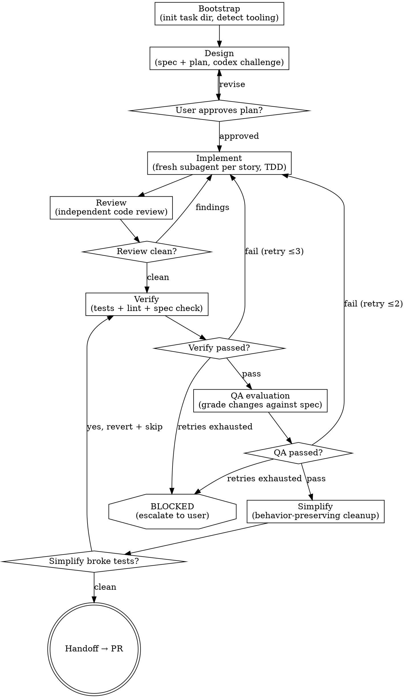

# Ship: Coding

Execute scoped code changes by orchestrating fresh subagents through a
9-phase pipeline — from design through PR — with quality gates at every
transition.

**Why orchestrator pattern:** You delegate every phase to specialized
subagents with isolated, precisely crafted context. They never inherit your
session history — you construct exactly what they need. You never read code,
write code, or run tests yourself; the guard hook enforces this mechanically.
This preserves your context window for the only work that matters:
bootstrapping state, interpreting results, deciding what to delegate next,
and advancing through the pipeline. **Never dispatch in background** — background agents trigger the
stop-gate prematurely because you have no pending tool calls.

**Core principle:** Read-only orchestrator + fresh subagent per phase +
artifact-driven quality gates = code that ships as a reviewed PR.

## Anti-Pattern: "I'll Just Do This One Thing Myself"

Every phase goes through a subagent. A one-line fix, a quick test run, a
"let me just read this file to check" — all of them. The moment you read
code yourself, you pollute your context window with implementation detail
that crowds out coordination work. The moment you write code yourself, you
bypass the quality gates that catch mistakes. "Simple" changes are where
unexamined assumptions cause the most wasted subagent cycles. The subagent
dispatch can be short (a focused prompt for truly simple tasks), but you
MUST delegate it.

## Checklist

You MUST create a task for each of these phases and complete them in order:

1. **Bootstrap** — init task dir, detect repo tooling, set task name
2. **Design** — dispatch subagent to write spec + plan; challenge with codex
3. **User approval** — present the plan, wait for explicit go/revise
4. **Implement** — dispatch implement subagent (per-story codex exec loop)
5. **Review** — dispatch independent code review subagent; loop fixes until clean
6. **Verify** — dispatch single opus pass for tests + lint + spec compliance
7. **QA evaluation** — dispatch independent evaluator to grade changes against spec
8. **Simplify** — dispatch behavior-preserving cleanup; revert if tests break
9. **Handoff** — quality gate check → create PR

Every phase is a subagent dispatch. If a phase fails, retry within limits
(see Retry Limits below) or escalate to the user as BLOCKED.

---

## Process Flow



**The terminal state is HANDOFF creating a PR.** Do NOT skip phases, reorder
them, or jump to PR creation without passing through the quality gates. The
only way out of the pipeline without a PR is BLOCKED → escalate to user.

<Bad>
- Jumping to implementing before `spec.md` and `plan.md` are complete.
  The plan looks ready after round 1, but the Codex challenge in round 2
  often finds real gaps.
- Skipping simplify because "the code already looks clean." The stop-gate
  checks for it. You will be sent back.
- Assuming subagent success from exit code 0. Always read the artifact
  file — it may be empty or incomplete.
</Bad>

## Step 1: Bootstrap

**CRITICAL: Activate hooks first.** The preamble runs setup which creates
the state file that activates plugin-level hooks (guard + stop-gate).
Without this, the orchestrator guard is inactive and nothing prevents
direct file writes.

```
Bash("bash ${CLAUDE_PLUGIN_ROOT}/bin/preamble.sh '<task description>'")
```

This does everything in one call:
1. Checks `codex` CLI is available (required for implementation)
2. Creates `.claude/ship-coding.local.md` state file → activates hooks
3. Creates task directory (`.ship/tasks/<task_id>/plan/`)
4. Detects languages, lint config, installs session git hooks
5. Reports `TASK_ID` and `TASK_DIR` for use in subsequent phases

- If `SHIP_INIT_NEEDED=true`: suggest `/setup` but do not block.

**New task:**
1. Read the preamble output to get `TASK_ID` and `TASK_DIR`.
2. Output: `[Ship] Task "<title>" created. Starting design phase...`

**Resuming:**
`.claude/ship-coding.local.md` is the single source of truth for the active
task. It is only deleted by stop-gate when all quality gates pass. If this file exists, you are resuming — read `task_id` and `task_dir`
from its frontmatter instead of re-running setup.

Then derive the resume phase. Each artifact is only written when its
phase's subagent completes — find the last completed artifact and
resume at the next phase:

| Last non-empty artifact | Resume at |
|-------------------------|-----------|
| (none) | Design (Step 2) |
| `plan/spec.md` + `plan/plan.md` | Implementing (Step 4) |
| `review.md` | Verifying (Step 6) |
| `verify.md` | QA (Step 7) |
| `qa.md` | Simplify (Step 8) |
| `simplify.md` | Handoff (Step 9) |

Output: `[Ship] Resuming task "<title>" — phase: <derived phase>`

### Step 2: Design

Produce stress-tested spec and plan through adversarial planning
(Claude plans, Codex challenges, 2-round convergence).

**Check existing:**
```
Bash("[ -s .ship/tasks/<task_id>/plan/spec.md ] && [ -s .ship/tasks/<task_id>/plan/plan.md ] && echo 'PLAN_FOUND' || echo 'NO_PLAN'")
```
If `PLAN_FOUND`: skip to "After design". If `NO_PLAN`: invoke plan.

**Invoke plan:** Dispatch a subagent with this prompt:

> You MUST call `Skill("plan")` as your first and only action.
> The skill contains all instructions. Do not attempt the task without it.
>
> Pass these parameters to the skill:
> - repo: <repo path>
> - task: <task description from user>
> - task_id: <task_id>
> - artifact_dir: .ship/tasks/<task_id>/plan/

You MUST NOT write spec or plan yourself — that is plan's job.

Verify after return:
```
Bash("[ -s .ship/tasks/<task_id>/plan/spec.md ] && [ -s .ship/tasks/<task_id>/plan/plan.md ] && echo 'DESIGN_READY' || echo 'DESIGN_INCOMPLETE'")
```
- `DESIGN_READY` → proceed
- `DESIGN_INCOMPLETE` → escalate: `[Ship] BLOCKED — plan did not produce complete artifacts.`
- Non-zero exit → see Subagent Error Recovery

**After design:**
1. Read `plan/plan.md`, extract stories (each implementation step → one story)
2. Present design to user for approval (Step 3)
3. Output: `[Ship] Design complete — <N> stories extracted. Awaiting approval...`

### Step 3: User Approval Gate

The ONE user interaction gate — everything else is autonomous.

Present summary via AskUserQuestion:
```
[Ship] Design complete. Here's what I'll build:

Goal: <1-2 sentence goal from spec.md>
Files affected: <list from spec.md>
Stories:
  1. <story title> (est. <N> files)
  2. ...
Estimated scope: <total stories> stories, <total files> file changes
```

Options:
- A) Looks good, proceed → implementing
- B) Revise the plan → re-delegate to design with feedback, re-present (max 2 rounds)
- C) Show full spec → output spec.md + plan.md, then re-ask A/B

---

### Step 4: Implementing

Output: `[Ship] Starting implementation — <N> stories to complete`

Record pre-dispatch HEAD SHA:
```
Bash("git rev-parse HEAD")
```

Dispatch a subagent with this prompt:

> You MUST call `Skill("implement")` as your first and only action.
> The skill contains all instructions. Do not attempt the task without it.
>
> Pass these parameters to the skill:
> - task_dir: .ship/tasks/<task_id>
> - spec: .ship/tasks/<task_id>/plan/spec.md
> - plan: .ship/tasks/<task_id>/plan/plan.md

**After return:** verify new commits were created:
```
Bash("git rev-parse HEAD")
```
Compare with pre-dispatch SHA. If HEAD unchanged → `[Ship] BLOCKED —
implement created no commits.`

If HEAD advanced → `[Ship] All stories implemented. Starting code review...`

### Step 5: Reviewing

Output: `[Ship] Running code review...`

Dispatch a subagent with this prompt:

> You MUST call `Skill("superpowers:requesting-code-review")` as your first and only action.
> The skill contains all instructions. Do not attempt the task without it.
>
> Pass these parameters to the skill:
> - repo: <repo path>
> - spec: .ship/tasks/<task_id>/plan/spec.md
> - diff_cmd: git diff main...HEAD
> - output: .ship/tasks/<task_id>/review.md

**After return:**
- Clean → `[Ship] Review clean. Starting verification...`
- Findings → `[Ship] Review found <N> issue(s). Fixing...`, use
  `codex exec` to fix findings, then re-review (max 3 rounds)

### Step 6: Verifying

Output: `[Ship] Running verification...`

Clear proof directory first:
```
Bash("rm -rf .ship/tasks/<task_id>/proof/current && mkdir -p .ship/tasks/<task_id>/proof/current")
```

Dispatch a subagent with this prompt:

> You MUST call `Skill("superpowers:verification-before-completion")` as your first and only action.
> The skill contains all instructions. Do not attempt the task without it.
>
> Pass these parameters to the skill:
> - repo: <repo path>
> - spec: .ship/tasks/<task_id>/plan/spec.md
> - proof_dir: .ship/tasks/<task_id>/proof/current/
> - output: .ship/tasks/<task_id>/verify.md

**After return:**
- Read `verify.md`. Derive `proof_status`: all evidence present → `collected`, some missing → `partial`, skipped → `skip`.
- All pass → QA evaluation. Failure → repair (see Retry Limits).

### Step 7: QA Evaluation

**Skip check:** `Bash("git diff main...HEAD --name-only")`
- Only test files, docs, or config changed → write `qa.md` with `<!-- QA_RESULT: SKIP 0/10 MUSTS:0/0 SHOULDS:0/0 CRITERIA:0 -->`, proceed to simplify.
- Otherwise → **always dispatch qa**. The orchestrator MUST NOT pre-empt
  qa's own skip logic. qa has its own tool detection and
  service startup — it decides what is testable.

Output: `[Ship] Running QA evaluation...`

Dispatch a subagent with this prompt:

> You MUST call `Skill("qa")` as your first and only action.
> The skill contains all instructions. Do not attempt the task without it.
>
> Pass these parameters to the skill:
> - spec: .ship/tasks/<task_id>/plan/spec.md
> - diff_cmd: git diff main...HEAD
> - output: .ship/tasks/<task_id>/qa.md
> - rubric_output: .ship/tasks/<task_id>/qa-rubric.md

**After return:**
- PASS → `[Ship] QA evaluation passed.`, proceed to simplify
- FAIL → `[Ship] QA evaluation failed. Fixing...`, delegate fix → re-verify → re-qa (max 2 rounds, then escalate)
- SKIP → `[Ship] QA evaluation skipped — <reason>.`, proceed to simplify


### Step 8: Simplify

**Skip check:** `git diff main...HEAD --name-only | grep -E '\.(go|py|ts|tsx|js|jsx|sh)$'`
- No code files → write `simplify.md` with `STATUS: SKIP`, proceed to handoff.

Output: `[Ship] Running simplify pass...`

Dispatch a subagent with this prompt:

> You MUST call `Skill("simplify")` as your first and only action.
> The skill contains all instructions. Do not attempt the task without it.
>
> Pass these parameters to the skill:
> - repo: <repo path>
> - output: .ship/tasks/<task_id>/simplify.md

**After return:**
- Code changed → re-run verification. If tests break, re-dispatch simplify subagent to fix (max 1 retry, then revert and proceed).
- No changes or success → proceed to handoff.

### Step 9: Handoff

Output: `[Ship] Delegating to handoff...`

Dispatch a subagent with this prompt:

> You MUST call `Skill("handoff")` as your first and only action.
> The skill contains all instructions. Do not attempt the task without it.
>
> Pass these parameters to the skill:
> - repo: <repo path>
> - task_dir: .ship/tasks/<task_id>
> - base_branch: main (or detected)

---

## Retry Limits

After the limit, the issue is structural — escalate instead of retrying.

| Trigger | Fix path | Max |
|---------|----------|-----|
| Test / lint fail | codex exec fix → re-verify | 3 |
| Review findings | codex exec fix → re-review | 3 |
| Spec gap | codex exec fix → re-verify → spec re-check | 3 |
| Spec wrong approach | re-implement → review → verify | 2 |
| QA failure | codex exec fix → re-verify → re-qa | 2 |
| Simplify breaks tests | re-dispatch simplify to fix → re-verify (1 retry, then revert) | 1 |

---

## Reference

### Orchestrator Rules

1. **Read anything, write nothing** — you have NO Write or Edit tools.
   All artifacts are produced by subagents. You exist to READ, DECIDE, DELEGATE.
   **Why:** You are a manager, not an IC. If you could write files, you'd
   skip phases by faking artifacts. The guard enforces this mechanically.
2. **All codebase work goes through subagents** — `codex exec` for
   implementation, `Agent` tool for judgment phases.
3. **Derive phase from artifacts** — `.claude/ship-coding.local.md` tracks
   the active task; artifact existence on disk tells you which phase to
   resume (see Bootstrap resume table).
4. **You own the decision loop** — read subagent output, decide next action
   (advance, retry, escalate).
   **Why:** Subagents have no memory between calls. Only you see the full picture across phases. If you don't drive the loop, nobody does.
5. **Always report progress** — output a status line after every phase
   transition and every subagent return (see Progress Reporting).
   **Why:** The user cannot see subagent activity. Without status lines, a 20-minute session looks like a hang.

### Progress Reporting

After every phase transition or subagent return, output a human-readable
status line so the user always knows what's happening. Format:

```
[Ship] <phase> <status> — <detail>
```

Examples:
```
[Ship] Bootstrap complete — task "add-dark-mode" created, 3 stories planned
[Ship] Design complete — spec and plan written, 4 stories identified
[Ship] Implementing story 1/4: "Add theme config type" ...
[Ship] Story 1/4 done (tests pass). Starting story 2/4: "Create toggle component" ...
[Ship] Story 2/4 done (tests pass). Starting story 3/4: "Wire up state" ...
[Ship] All 4 stories implemented. Starting code review...
[Ship] Review found 1 normal issue. Delegating fix...
[Ship] Review clean after 1 fix round. Starting verification...
[Ship] Mechanical verification passed. Starting spec verification...
[Ship] All checks pass. Creating PR...
[Ship] PR created: https://github.com/...
```

Rules:
- Every status line starts with `[Ship]`
- Include counts when iterating (story 2/4, fix round 2/3)
- On failure: `[Ship] Story 2/4 FAILED — test timeout. Retrying (1/2)...`
- On block: `[Ship] BLOCKED — 3 fix attempts exhausted. See report below.`
- Never go silent for more than one subagent call without a status update

### Decision Principles

When making decisions at any phase transition, use these principles in order:

1. **Complete over partial** — Ship the whole thing. Cover all edge cases,
   not just the happy path. The marginal cost of completeness is near-zero.
2. **Fix in blast radius** — If something is broken in files touched by this
   task, fix it now. Don't defer to a follow-up.
3. **Explicit over clever** — 10-line obvious fix > 200-line abstraction.
   Pick what a new contributor reads in 30 seconds.
4. **DRY** — Duplicates existing functionality? Reuse. Don't reinvent.
5. **Bias toward action** — Advance > deliberate > stall. Log concerns
   but keep moving. Only stop if truly blocked (retries exhausted,
   missing information that cannot be inferred from code).
6. **Escalate honestly** — When retries are exhausted or confidence is low,
   stop and tell the user. Bad work is worse than no work.

### Only stop for

- User approval gate (step 3) — present plan, wait for go
- Retries exhausted at any phase — escalate to BLOCKED
- Subagent output is incoherent or contradictory
- Task scope grew beyond original spec
- Merge conflicts that can't be auto-resolved

### Never stop for

- Choosing which story to implement next (follow plan order)
- Mechanical failures within retry limits (fix and re-verify)
- Review findings within retry limits (fix and re-review)
- Simplify finding nothing to change (proceed to handoff)
- qa returned SKIP verdict (proceed to handoff — but you must have dispatched qa first; pre-emptive skip by you is not allowed, nor from your own judgment)

### Escalation Protocol

When retries are exhausted, output is incoherent, or scope grew beyond spec:
set `status` to `blocked`, add an issue, and report:

```
[Ship] BLOCKED
REASON: [what failed and why]
ATTEMPTED: [what was tried, how many times]
RECOMMENDATION: [what the user should do next]
```

<Bad>
- Skipping a failing phase ("tests are flaky, just move on")
- Weakening acceptance criteria to make verify pass
- Using `// TODO` instead of implementing
- Rewriting spec to match what was built instead of what was asked
</Bad>

### Subagent Error Recovery

| Exit | Action |
|------|--------|
| 0 + empty artifact | Retry once, then escalate |
| 1 | Read stderr, retry with adjusted prompt (max 2) |
| 124 (timeout) | Break story smaller, retry |
| 137 (OOM) | Reduce scope, retry once |
| 429 / rate limit | Wait 30s, retry once |
| Other | Escalate to user |
