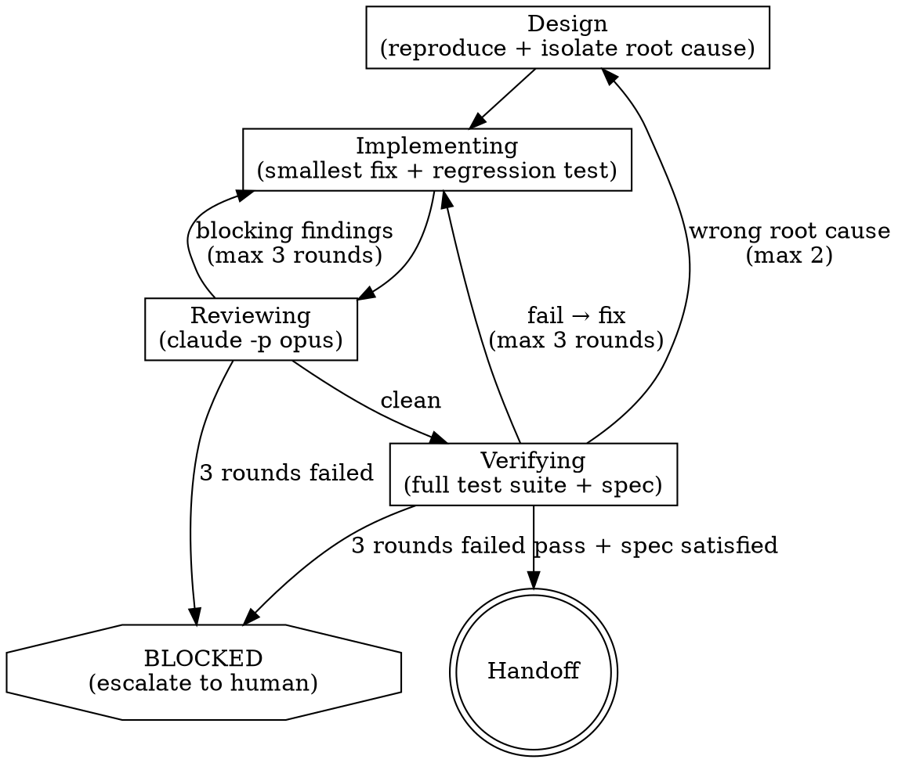

# Ship: Debug

Fix the root cause, not the symptom. Constraint-driven workflow for
investigation and targeted repair. The defining characteristic is that the
cause of the failure is unknown at task start. If the cause is already known,
use `auto` instead.

Debug workflows do not use simplify — debug fixes should be minimal and
targeted. If the fix grows large, cleanup belongs in a follow-up refactor task.

---

## Superpowers Skill Interop

| Phase | Superpowers Skill | When to invoke |
|-------|-------------------|----------------|
| design (reproduce + isolate) | `systematic-debugging` + `writing-plans` | Always — this is the core methodology |
| implementing (smallest fix) | `test-driven-development` | Writing the targeted fix |
| reviewing | `requesting-code-review` | Independent review of the fix |
| verifying | `verification-before-completion` | Confirm fix + no regression |

If superpowers is not installed, the guidance below is self-contained.

---

## Decision Principles

When making decisions at any phase transition, use these principles in order:

1. **Complete over partial** — Ship the whole thing. Cover all edge cases,
   not just the happy path. The marginal cost of completeness is near-zero.
2. **Fix in blast radius** — If something is broken in files touched by this
   task, fix it now. Don't defer to a follow-up.
3. **Explicit over clever** — 10-line obvious fix > 200-line abstraction.
   Pick what a new contributor reads in 30 seconds.
4. **DRY** — Duplicates existing functionality? Reuse. Don't reinvent.
5. **Bias toward action** — Advance > deliberate > stall. Log concerns
   but keep moving. Only stop if truly blocked (retries exhausted,
   missing information that cannot be inferred from code).
6. **Escalate honestly** — When retries are exhausted or confidence is low,
   stop and tell the user. Bad work is worse than no work.

## Decision Classification

Every decision falls into one of two categories:

**Mechanical** — one clearly right answer given the principles above.
Auto-decide silently. Examples:
- Tests failed → retry with error context (principle 5)
- Review found critical issue → delegate fix (principle 5)
- 3 retries exhausted → escalate to BLOCKED (principle 6)

**Judgment** — requires weighing trade-offs. Auto-decide using principles,
but log the decision and rationale to the audit trail. Examples:
- Root cause has two plausible explanations → which to pursue?
- Review found normal issue → fix or defer?
- Fix scope is growing → stay focused or expand?

Both categories are auto-decided. The difference is logging:
mechanical decisions are silent, judgment decisions are logged.

## Decision Audit Trail

For every judgment decision, append a row to
`.ship/tasks/<task_id>/decisions.md`:

```markdown
| # | Phase | Decision | Principle | Rationale |
|---|-------|----------|-----------|-----------|
| 1 | design | Pursue nil pointer as root cause over race condition | 5 (action) | Stack trace points directly to nil deref, race is speculative |
| 2 | reviewing | Defer cleanup of adjacent error handling | 2 (blast radius) | Not in files touched by this fix |
```

Rules:
- Create the file with header row when the first judgment decision occurs
- Append incrementally via Edit — do not rewrite the whole file
- One row per decision, keep rationale to one sentence
- The stop gate does NOT check this file (it is informational, not a gate)

## Escalation Protocol

The orchestrator MUST stop and report to the user when:
- Retries exhausted at any phase (3 fix rounds or 2 re-designs)
- Root cause cannot be isolated after systematic investigation
- Fix would require changes outside the task's blast radius
- Confidence in the root cause is low

When escalating, report to the user:

```
STATUS: BLOCKED
REASON: [1-2 sentences]
ATTEMPTED: [what was tried and how many times]
RECOMMENDATION: [what the user should do next]
```

Do not attempt to work around the blocker. Do not retry beyond limits.
Bad work is worse than no work.

---

## State Management

State is derived from artifacts on disk under `.ship/tasks/<task_id>/`.
The orchestrator never writes state files — phase is determined by which
artifacts exist and their content.

Before starting or resuming any debug task, run the ship preamble:
`Bash("bash ${CLAUDE_PLUGIN_ROOT}/bin/preamble.sh debug")`

### Artifact-Based State

| Artifact | Created in | Meaning |
|----------|-----------|---------|
| `spec.md` | design | Root cause identified, fix described |
| `plan.md` | design | Ordered stories for the fix |
| `review.md` | reviewing | Review findings and outcome |
| `verify.md` | verifying | Test results and spec verification |
| `decisions.md` | any phase | Judgment decision audit trail |

Phase is derived:
- No artifacts → design
- `plan.md` + `spec.md` exist → implementing
- `review.md` has content → reviewing/verifying
- `verify.md` has passing results → handoff

---

## Phase Guidance



### Design (Reproduce + Isolate)

The primary job is root cause isolation, not planning a feature.

- Reproduce the failure with a concrete test or repro script
- Isolate the root cause through systematic narrowing
- Write a minimal spec: what is broken, what is the root cause, what is the fix
- Write spec to `.ship/tasks/<task_id>/spec.md` (filled with content)
- Write plan to `.ship/tasks/<task_id>/plan.md` (filled with content)
- Create empty artifact stubs for phases not yet reached:
  - `review.md` — empty stub (reviewing phase fills)
  - `verify.md` — empty stub (verifying phase fills)
- Create the task directory with `mkdir -p .ship/tasks/<task_id>`
- Proceed once the plan is recorded unless the task truly requires a user
  decision, explicit design approval, or missing information that cannot be
  derived from repo truth or task state

**Before advancing to implementing:**
- [ ] `spec.md` is filled (root cause identified)
- [ ] `plan.md` is filled with ordered stories

### Implementing (Smallest Fix)

Write the smallest change that fixes the root cause.

- Delegate to a fast execution model (codex by default):
  `Bash("codex exec '<fix description + root cause context>' --full-auto")`
- **Must include a regression test** that fails before the fix and passes after
- Each commit must pass pre-commit lint

**Before advancing to reviewing:**
- [ ] Active story's work is committed
- [ ] Regression test exists and passes

### Reviewing

Independent review of the fix and regression test.

- Delegate to a high-reasoning model (claude by default):
  `Bash("claude -p '<review prompt>'")`
- **Review MUST use an opus-level model**
- Focus: does the fix address root cause? Is the regression test sufficient?
- Record in `.ship/tasks/<task_id>/review.md`
- If blocking findings: delegate fix based on `review.md`, fix → re-review (max 3 rounds)

**Before advancing to verifying:**
- [ ] `review.md` shows clean review

### Verifying

Confirm the fix works and no regressions were introduced.

- **Mechanical:** run full test suite, not just the new regression test
  - Record results in `verify.md` (append section with command output,
    pass/fail, HEAD sha)
- **Spec:** verify the original failure is resolved
  - Record results in `verify.md`

**Before advancing to handoff:**
- [ ] `verify.md` is filled with passing results
- [ ] All stories implemented (check git log)
- [ ] `review.md` clean, `verify.md` passing

### Handoff

- Self-check quality gate (see below)
- Ensure all changes are on a feature branch
  (if on main/master: `Bash("git checkout -b ship/<task_id>")`)
- Push and create PR:
  `Bash("git push -u origin HEAD && gh pr create --title '<task title>' --body \"$(cat .ship/tasks/<task_id>/spec.md)\n\n---\n🤖 Generated with [SHIP](https://www.ship.tech/)\"")`

---

## Delegation Routing Defaults

Same as auto. Review and spec verification must use opus-level model.

---

## Recovery Loops

| Trigger | Path | Max retries |
|---------|------|-------------|
| Mechanical failure | verify → fix → verify | 3 |
| Review blocking findings | review → fix → review | 3 |
| Spec still failing | spec → fix → mechanical → spec | 3 |
| Wrong root cause | spec → re-isolate (back to design) | 2 |

After retries exhausted → escalate to user and stop.
Do not attempt further.

---

## Quality Gate Self-Check

Before completing, check artifacts on disk and verify ALL of the following:

**Artifacts filled (no empty .md files):**
- [ ] `spec.md` — has content (root cause + fix description)
- [ ] `plan.md` — has content
- [ ] `review.md` — has clean review content
- [ ] `verify.md` — has passing verification results

**State is clean (check artifacts):**
- [ ] All stories implemented (check git log)
- [ ] No open critical/normal findings in `review.md`
- [ ] `verify.md` shows all tests passing

If any check fails, go back to the phase that owns it.
