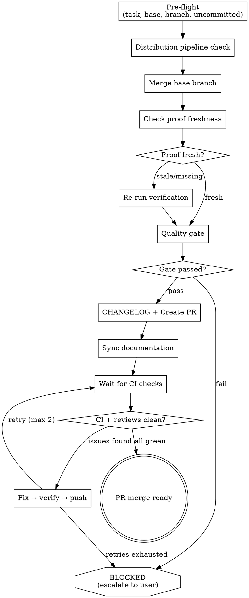

# Ship: Handoff

This is a **non-interactive, fully automated** workflow. Do NOT ask for confirmation at any step.
Run straight through — create PR, fix CI, address reviews, resolve conflicts — and output the merge-ready
PR URL at the end.

**Core principle:** PR creation is not the finish line. The finish line is
CI green + reviews addressed + no conflicts. Automate the entire post-PR
loop to minimize human intervention.

## Anti-Pattern: "PR Created, We're Done"

Creating a PR and stopping is shipping half the work. CI will fail, reviewers
will comment, base branch will drift. If you stop at PR creation, the user
has to manually handle every round of fixes — exactly the work this skill
exists to eliminate. Always enter the post-PR loop.

**Only stop for:**
- CI failures after 2 fix rounds exhausted
- Review comments that require user judgment (architectural decisions, security trade-offs — not style)
- Quality gate artifacts missing with no owning phase to re-run
- New standalone artifact detected with no distribution pipeline (Step 1.5)

**Never stop for:**
- On the base branch (auto-create `ship/<task_id>` branch)
- Stale or missing proof (auto re-verify)
- CI failures within retry limits (read logs, fix, re-push)
- Simple review comments (auto-address and push)
- Merge conflicts (auto-resolve — fetch base, merge, fix conflicts, push)
- PR body content (auto-generate proof bundle)
- Branch creation or naming (auto-handle)
- Uncommitted changes (always include them)

## Checklist

1. **Pre-flight** — find task dir, detect base branch, ensure feature branch, commit uncommitted changes
2. **Distribution pipeline check** — verify release workflow exists if new artifact detected
3. **Merge base branch** — fetch and merge base so all checks run on merged state
4. **Check proof freshness** — verify evidence files match current HEAD
5. **Re-verify if needed** — re-run tests/lint if proof is stale or missing
6. **Quality gate** — check all required artifacts
7. **CHANGELOG** — auto-generate entry if CHANGELOG.md exists
8. **Create PR** — push, create PR with proof bundle
9. **Sync documentation** — update drifted docs, commit, push
10. **Wait for CI** — poll checks until complete
11. **Fix loop** — address CI failures, review comments, merge conflicts (max 2 rounds)
12. **Report** — PR is merge-ready or escalate

## Process Flow



**The terminal state is PR merge-ready.** Do NOT stop at PR creation.
The only exit without a merge-ready PR is BLOCKED → escalate to user.

---

## Step 1: Pre-flight

**1. Find task directory:**
```
Bash("REPO_ROOT=$(git rev-parse --show-toplevel) && TASK_DIR=$(find $REPO_ROOT/.ship/tasks -type d -name plan -maxdepth 2 2>/dev/null | head -1 | xargs dirname 2>/dev/null) && echo \"TASK_DIR: $TASK_DIR\"")
```
If no task dir found, create a minimal one from the current branch name.

**2. Detect base branch:**
1. `gh pr view --json baseRefName -q .baseRefName` — if PR already exists
2. `gh repo view --json defaultBranchRef -q .defaultBranchRef.name` — fallback
3. `main` — last resort

**3. Branch check:**
If on base branch → auto-create feature branch: `git checkout -b ship/<task_id>`

**4. Uncommitted changes:**
`git status` (never use `-uall`). If uncommitted changes exist, auto-commit:
```
Bash("git add -A && git commit -m 'chore: include uncommitted changes for handoff'")
```

**5. Understand the diff:**
```
Bash("git diff <base>...HEAD --stat && git log <base>..HEAD --oneline")
```

Output: `[Ship] Handoff starting — task: <task_id>, base: <branch>, <N> commits, <N> files changed`

---

## Step 1.5: Distribution Pipeline Check

If the diff introduces a new standalone artifact (CLI binary, library package, tool),
verify that a distribution pipeline exists.

1. Check for new entry points:
   ```
   Bash("git diff <base> --name-only | grep -E '(cmd/.*/main\.go|bin/|Cargo\.toml|setup\.py|package\.json)' | head -5")
   ```
2. If detected, check for release workflow:
   ```
   Bash("ls .github/workflows/ 2>/dev/null | grep -iE 'release|publish|dist'")
   ```
3. No release pipeline + new artifact → AskUserQuestion:
   - A) Add a release workflow now
   - B) Defer — note in PR body
   - C) Not needed — internal/web-only, existing deployment covers it
4. Release pipeline exists or no new artifact → continue silently.

---

## Step 2: Merge Base Branch

Fetch and merge the base branch so all subsequent checks run on the merged state:
```
Bash("git fetch origin <base> && git merge origin/<base> --no-edit")
```

- Already up to date → continue silently.
- Merge conflicts → auto-resolve (dispatch subagent if complex). Commit resolved merge.

Output: `[Ship] Base branch merged.` or `[Ship] Already up to date.`

---

## Step 3: Check Proof Freshness

```
Bash("HEAD=$(git rev-parse HEAD) && echo \"HEAD: $HEAD\" && for f in .ship/tasks/<task_id>/proof/current/*.txt; do [ -f \"$f\" ] && echo \"$(basename $f): $(head -1 $f)\"; done")
```

Compare each `HEAD_SHA=` against current HEAD.

- All files present + all SHA match → `proof_status: fresh`, skip to Step 5
- Some files missing or SHA mismatch → `proof_status: stale`, proceed to Step 4
- No proof dir at all → `proof_status: missing`, proceed to Step 4

Output: `[Ship] Proof status: <fresh|stale|missing>`

---

## Step 4: Re-verify

Only runs if proof is stale or missing. Dispatch verification subagent:

```
Bash("rm -rf .ship/tasks/<task_id>/proof/current && mkdir -p .ship/tasks/<task_id>/proof/current")
```

```
Agent(prompt="Run tests, linter, and type checker in <repo path>.
Write evidence files to .ship/tasks/<task_id>/proof/current/:
- tests.txt — first line: HEAD_SHA=<sha>, then full output
- lint.txt — first line: HEAD_SHA=<sha>, then full output
- coverage.txt — first line: HEAD_SHA=<sha>, then coverage summary (if applicable)

If .ship/tasks/<task_id>/plan/spec.md exists:
  Run: git diff <base>...HEAD
  Verify each acceptance criterion against the spec.
If no spec.md (standalone invocation):
  Verify tests pass and lint is clean — skip spec compliance.

Write results to .ship/tasks/<task_id>/verify.md.",
subagent_type="general-purpose")
```

If verify fails → fix and re-verify (max 2 rounds, then escalate).

Output: `[Ship] Re-verification complete.`

---

## Step 5: Quality Gate

Check required artifacts exist and are non-empty:
- [ ] `plan/spec.md`, `plan/plan.md` — if task dir has `plan/` (skip for standalone invocation)
- [ ] `review.md` — if task dir has it (skip for standalone invocation)
- [ ] `verify.md`
- [ ] `qa.md` — only if code files changed (`git diff <base>...HEAD --name-only | grep -E '\.(go|py|ts|tsx|js|jsx|sh)$'`)
- [ ] `simplify.md` — only if code files changed (same check)

If any required artifact missing → go back to the phase that owns it, or escalate.

Output: `[Ship] Quality gate passed.`

---

## Step 5.5: CHANGELOG (auto-generate)

**Skip check:** `[ -f CHANGELOG.md ] || echo 'NO_CHANGELOG'`
- No CHANGELOG.md → skip silently.

If CHANGELOG.md exists:
1. Read header to learn the format
2. Generate entry from all commits: `git log <base>..HEAD --oneline`
3. Categorize into sections:
   - `### Added` — new features
   - `### Changed` — changes to existing functionality
   - `### Fixed` — bug fixes
   - `### Removed` — removed features
4. Insert after file header, dated today
5. Commit: `git add CHANGELOG.md && git commit -m "docs: update CHANGELOG"`

Do NOT ask the user to describe changes. Infer from diff and commit history.

---

## Step 6: Create PR

**Build proof bundle:**
For each `.txt` in `proof/current/`, compare `HEAD_SHA=` against current HEAD.
`proof_status` precedence: stale > partial > collected > skip.

**PR body template:**
```markdown
## Summary
<bullet points inferred from git log <base>..HEAD --oneline and diff>

## Ship Proof Bundle
HEAD: `<sha>`

| Check | Status | Fresh |
|-------|--------|-------|
| tests | PASS/FAIL | Yes/Stale |
| lint | PASS/WARN | Yes/Stale |
| coverage | PASS/SKIP | Yes/Stale |
| qa | PASS/FAIL/SKIP | Yes/Stale |
| spec | PASS/FAIL | Yes/Stale |

## Test Coverage
<coverage summary from proof/current/coverage.txt, or "All new code paths have test coverage.">

## Review Findings
<summary from review.md — N issues, M fixed, K info-only. Or "No issues found.">

## Test Plan
- [x] All tests pass (<N> tests)
- [x] Lint clean
- [x] Spec compliance verified

```
If any evidence stale, append: `⚠ Evidence stale — re-run verify to refresh.`

Do NOT ask the user to write the summary or test plan. Infer everything from
diff, commit history, and proof artifacts.

**Push and create:**
1. `git push -u origin HEAD`
2. `gh pr create --title "<title>" --body "<proof bundle>"` (if `gh` available)
3. If PR already exists: `gh pr comment` with updated proof table

Output: `[Ship] PR created: <url>`

---

## Step 6.5: Sync Documentation

After PR is created, auto-sync project documentation so docs never drift
from code. Good docs = good AI harness for future sessions.

1. Read the diff: `git diff <base>...HEAD --name-only`
2. For each changed source file, check if related docs may be stale:
   - README.md — setup, run, config instructions
   - AGENTS.md / CLAUDE.md — architecture, task routing, conventions
   - docs/ — design docs, API references
3. If any doc needs updating → update, commit, push:
   ```
   Bash("git add -A && git commit -m 'docs: sync documentation with shipped changes' && git push")
   ```
4. If all docs are current → skip silently.

This step is automatic. Do not ask for confirmation.

---

## Step 7: Wait for CI

Poll CI checks until all complete:
```
Bash("gh pr checks --watch")
```

If `gh pr checks --watch` is not available, poll manually:
```
Bash("gh pr checks")
```
Repeat every 60 seconds until no checks are `pending` (max 45 minutes).

Also check for review comments:
```
Bash("gh pr view --json reviewRequests,reviews,comments --jq '{reviews: [.reviews[] | {state: .state, author: .author.login}], comments: .comments | length}'")
```

Output: `[Ship] CI complete — <N> passed, <N> failed. <N> review comments.`

---

## Step 8: Fix Loop

If CI failures, review comments, or merge conflicts exist, fix them.
Max 2 rounds — after that, escalate.

**CI failures:**
1. Read failed check logs: `gh pr checks` to identify failures
2. Read CI log output: `gh run view <run_id> --log-failed`
3. Dispatch fix subagent with failure context
4. Commit fix

**Review comments:**
1. Read comments: `gh pr view --comments`
2. Address each actionable comment (ignore bot/automated comments)
3. Commit fixes
4. Minimize resolved comments

**Merge conflicts:**
1. Fetch and merge base: `git fetch origin <base> && git merge origin/<base>`
2. Auto-resolve all conflicts (dispatch subagent if complex)
3. Commit resolved merge

**Verification gate — BEFORE every push:**
If ANY code changed during this fix round, re-run tests before pushing.
- "Should work now" → RUN IT.
- "I'm confident" → Confidence is not evidence.
- "It's a trivial change" → Trivial changes break production.
If tests fail → fix and re-verify. Do NOT push with failing tests.

After verification passes → `git push` → go back to Step 7 (wait for CI).

Output per round: `[Ship] Fix round <i>/2 — <what was fixed>. Tests pass. Re-checking CI...`

---

## Step 9: Report

**PR merge-ready:**
```
[Ship] PR merge-ready: <url>
CI: all green
Reviews: addressed
Conflicts: none
```

**Escalate (after 2 fix rounds):**
```
[Ship] BLOCKED — PR not merge-ready after 2 fix rounds.
REMAINING: <what's still failing>
ATTEMPTED: <what was fixed>
RECOMMENDATION: <what user should do>
PR: <url>
```

---

## Reference

### Retry Limits

| Trigger | Fix path | Max |
|---------|----------|-----|
| CI failure | read logs → fix → push → re-check | 2 |
| Review comments | read → fix → push → re-check | 2 |
| Merge conflicts | fetch base → resolve → push | 2 |
| Proof stale/missing | re-run verification | 2 |
| Quality gate fail | go back to owning phase | 1 |

After limit → escalate with BLOCKED report.

### Progress Reporting

Every status line starts with `[Ship]`. Include round counts when iterating.

```
[Ship] Handoff starting — task: add-dark-mode, base: main
[Ship] Proof status: fresh
[Ship] Quality gate passed.
[Ship] PR created: https://github.com/...
[Ship] CI complete — 3 passed, 1 failed. 0 review comments.
[Ship] Fix round 1/2 — fixed lint failure in handler.go. Re-checking CI...
[Ship] CI complete — 4 passed, 0 failed. 2 review comments.
[Ship] Fix round 2/2 — addressed 2 review comments. Re-checking CI...
[Ship] PR merge-ready: https://github.com/...
```

### Important Rules

- **Never push without fresh verification evidence.** If code changed, re-run tests first.
- **Never force push.** Use regular `git push` only.
- **Never skip the fix loop.** PR created ≠ done. CI green + reviews addressed = done.
- **Never ask for trivial confirmations.** "Ready to push?" "Create PR?" — just do it.
- **Date format in CHANGELOG:** `YYYY-MM-DD`
- **The goal is: user says `/handoff`, next thing they see is a merge-ready PR URL.**
