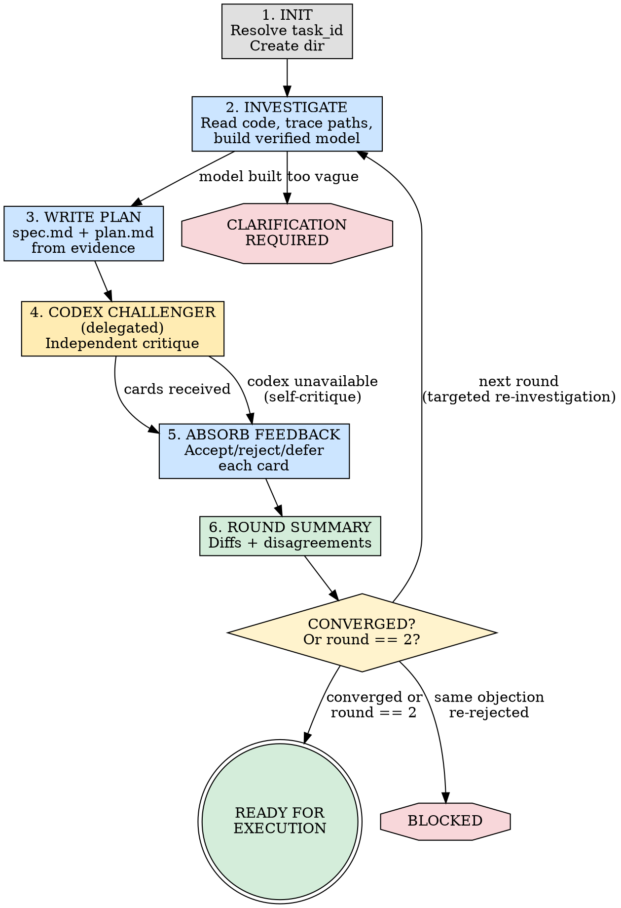

# Ship: Plan

You ARE the planner. You read code, investigate, write spec and plan.
You must read the code yourself — delegating investigation loses the
context needed to write a good plan. Only the Codex challenger pass
is delegated.

## Core Principle

```
NO INVESTIGATION, NO PLAN.
```

Every claim in spec.md and plan.md must be backed by code evidence you
personally verified. You do not guess. You do not assume. You read the
code, trace the paths, and record what you found. Unverified claims are
flagged as assumptions, not stated as facts.

## Master Flow



### Only stop for
- Task too vague to plan → ask user via AskUserQuestion
- Same objection re-rejected without new evidence → `blocked`
- Timeout (10 min/round, 20 min total) → preserve artifacts, summarize honestly

### Never stop for
- Codex unavailable (self-critique with warning)
- Challenger parse failure (retry once, then skip with warning)
- Round 2 without convergence (proceed to `ready_for_execution` with warnings)

## Task ID

1. If invoked by ship-coding, the task_id is provided and
   `.ship/tasks/<task_id>/plan/` already exists.
2. If invoked standalone, generate `task_id` as a short slug from the task
   description (e.g., "fix login timeout" → `fix-login-timeout`).
   ```
   mkdir -p .ship/tasks/<task_id>/plan
   ```

## Overview

- You are both the investigator and the planner. No delegation for these.
- Fixed 2-round loop. `max_rounds` is always `2`.
- Codex is the independent challenger. Delegated via `codex exec`.
- `--single-model`: replace Codex with self-critique (same card format).

## What You Do vs What You Delegate

| Phase | Who | Why |
|-------|-----|-----|
| Investigation (read code, trace paths) | **You** | You need the context to write a good plan |
| Write spec.md + plan.md | **You** | Investigation context must not be lost |
| Challenger review | **Codex** (delegated) | Independence requires separation |
| Absorb feedback + revise | **You** | You have the context to judge cards |
| Path validation of cards | **You** | Quick file existence checks |

## Hard Rules

1. You read all code you reference. No citing files you haven't opened.
2. Codex never writes artifacts. Codex only reads and critiques.
3. Challenger contract re-sent every round. Never rely on memory.
4. Disk artifacts are truth. Prior conversation is reference only.
5. Forced best objection. Even when Codex agrees, it must provide its
   strongest remaining objection.

## Decision Principles

Complete investigation > Explicit claims > Bias toward action > Escalate honestly.

"Complete" means investigation covers the full path and artifacts cover
requirements and edge cases. "Escalate honestly" means stop at `blocked`
rather than pretending the task is ready.

---

## Phase 1: Init

- Resolve task_id, create `.ship/tasks/<task_id>/plan/` directory.
- If resuming, read existing artifacts and determine current state.
- Collect branch name and HEAD SHA.

## Phase 2: Investigate

**This is the most important phase. Do not rush it.**

Read the codebase systematically before writing any plan. Your goal is
to build a verified mental model of the relevant code, so that every
claim in your plan traces back to something you actually read.

### For bug fixes — trace the full data/call path:

1. **Start at the symptom.** Find the function that produces the wrong
   output or behavior. Read it.
2. **Trace BACKWARD (callers).** Who calls this function? With what
   arguments? Go at least 2 levels up. Use `grep -rn "functionName"` to
   find all call sites. Read each one.
3. **Trace FORWARD (consumers).** Who uses the output? At least 2 levels
   down. Read those too.
4. **Search for existing defenses.** Before proposing a new guard or
   fix, search for code that already handles this problem:
   `grep -rn "relatedKeyword"`. If you find existing defenses, explain
   why they are insufficient — or reconsider your root cause.
5. **Check for the fix already applied upstream.** The most common
   planning error is finding a gap in function A, without noticing that
   function A's caller already compensates for it. Trace the full path.

### For new features — map the integration surface:

1. **Find analogous features.** Search for similar existing features.
   How are they wired in? What files do they touch?
2. **Trace the integration path.** Follow a similar feature from config →
   registration → runtime → UI/API surface. Every file it touches is a
   candidate for your plan.
3. **Check for existing infrastructure.** Does the foundation you need
   already exist? Don't reinvent what's there.

### For all tasks:

- **Verify file existence** before proposing to create new files
  (`test -f "path"`). If it exists, propose extending it.
- **Search for existing tests** that assert the current behavior you
  plan to change (`grep -rn "oldValue" --include="*.test.*"`). These
  tests will break — list them in your plan.
- **Cross-reference all consumers** when defining schemas or interfaces.
  Grep for the type name and every field name. Build a complete
  inventory, not a partial one.

### Record your investigation

Write an `## Investigation` section in spec.md with:
- What you traced (call chain / data flow / integration path — file:line)
- What existing relevant code you found (guards, validators, analogous features)
- What you verified and how
- What assumptions remain unverified (flag these explicitly)

**A spec.md without an Investigation section is incomplete.**
**A plan.md that references code you haven't read is invalid.**

## Phase 3: Write Plan

With your investigation complete, write `spec.md` and `plan.md`.

### spec.md structure

```markdown
## Investigation
### What was traced
- [call chain / data flow / integration path with file:line refs]

### Existing relevant code
- [guards, validators, analogous features found — with file:line]

### Unverified assumptions
- [anything you could not confirm from code alone]

## Requirements
[derived from the task + your investigation findings]

## Non-goals
[what this task explicitly does NOT do — prevents implementor over-building]

## Acceptance Criteria
[concrete, testable criteria]
```

### plan.md structure

Implementation steps with:
- Specific file paths and line numbers (from your investigation)
- What to change and why
- Tests that will break and how to update them
- New tests needed

## Phase 4: Codex Challenger (Delegated)

Compose a prompt containing the challenger contract (verbatim below)
plus all artifact contents. Delegate via:
- `Bash("codex exec -s read-only '<prompt>' --full-auto")` (default)
- Self-critique with same card format (when Codex unavailable)

### Challenger contract

```text
You are the CHALLENGER for this task. Your role:
- Read the canonical artifacts on disk AND the repository source code as the source of truth.
- Prior conversation is reference only; artifacts and code override memory.
- Produce 3-7 FALSIFICATION CARDS. Each card must be one of three types:

  TYPE A — Code-grounded:
  1. Failure scenario: what specifically breaks
  2. Impacted path: file and line (or function/struct name) — must resolve to an existing file at HEAD or a file the plan explicitly proposes to create
  3. Repo evidence: actual code snippet proving the issue exists
  4. Severity: blocker | major | minor
  5. Required plan change: what the plan must do differently

  TYPE B — Structural:
  1. Failure scenario: what specifically breaks
  2. Plan section: which section of spec.md or plan.md this challenges
  3. Logical evidence: the reasoning chain showing why this would fail
  4. Severity: blocker | major | minor
  5. Required plan change: what the plan must do differently

  TYPE C — Investigation gap:
  1. What the planner claims without sufficient evidence
  2. What code path was NOT traced (e.g., "callers of X were not checked")
  3. Counter-evidence or plausible alternative found by reading the code
  4. Severity: blocker | major | minor
  5. What investigation the planner must do before this claim can stand

- For Type A cards: any card without a file path that exists at HEAD (or is listed as a new file in the plan) and a code snippet from that file is INVALID and will be discarded.
- For Type B cards: any card without a specific plan section reference and a logical argument is INVALID and will be discarded.
- For Type C cards: you must show concrete counter-evidence (a file:line
  the planner did not read, a caller they did not trace, an existing
  defense they did not mention). "The investigation might be incomplete"
  without evidence is INVALID.
- If fewer than 3 genuine issues exist, produce your best cards and mark the remainder as low-confidence.
- You NEVER write to spec.md or plan.md; you only challenge.
- Even if you agree overall, you MUST provide a Strongest Card.

INVESTIGATION REVIEW (always perform, in addition to cards above):
Before writing cards, independently verify the planner's Investigation
section in spec.md. For each key claim, check whether the planner
actually read the code they cite. Specifically:
- Trace the call chain one level further than the planner did.
  Did they miss a caller/consumer that changes the picture?
- Search for existing code that already handles the problem.
  Did the planner overlook a defense, guard, or fallback?
- Check if files the planner proposes to create already exist.
- Check if values the planner proposes to change are asserted
  in existing tests.
Flag any gaps as Type C cards.
```

### Challenger output format

```markdown
### Card 1: [Short title]
- **Type:** code | structural | investigation-gap
- **Failure:** [What breaks and why]
- **Path:** `path/to/file:42` — `FunctionName` (code/investigation-gap type) OR **Section:** spec.md § "Section Name" (structural type)
- **Evidence:**
  ```
  // actual code or logical reasoning
  ```
- **Severity:** blocker | major | minor
- **Required change:** [What the plan must do differently]

### Card 2: ...
(repeat for each card, 3-7 total)

### Strongest Card
[Which card above is most likely to cause real failure, and why]

### Metrics
- Total cards: N
- Code-grounded: N
- Structural: N
- Investigation-gap: N
- Blockers: N | Major: N | Minor: N
```

### Path validation

After receiving challenger output, validate Type A and Type C cards:
- For each file path, run `test -f "$path"`.
- Cards with invalid paths that aren't planned new files → INVALID.
- Write validated cards to `review-log.md`.

## Phase 5: Absorb Feedback

For every challenger card, decide: `accepted`, `rejected`, or `deferred`.

- **accepted** → update spec.md and/or plan.md now.
  For Type C cards: do the additional investigation, then update.
- **rejected** → log specific rationale. You must cite code evidence
  for your rejection, not just dismiss the card.
- **deferred** → note in review-log.md with reason.

Record all decisions in `review-log.md`.

## Phase 6: Round Summary

- Compute diffs for spec.md and plan.md.
- Count remaining disagreements.
- Increment round counter.
- Publish human-readable summary.
- After final round, append metrics to `review-log.md`.

## Convergence

Mechanical convergence requires all of:
- `spec.md` diff fewer than 5 lines this round
- `plan.md` diff fewer than 5 lines this round
- `remaining_disagreements == 0`

Rules:
- "Strongest Card" does not count as disagreement unless accepted.
- Stop after `max_rounds == 2` with warnings for unresolved items.
- If same objection re-rejected without new evidence → `blocked`.

---

## Canonical Artifacts

```text
.ship/tasks/<task_id>/
  plan/
    spec.md         — what to build (investigation + requirements)
    plan.md         — how to build it (steps with file:line refs)
    review-log.md   — debate record (cards, decisions, metrics)
```

---

## Timeouts

- Maximum 10 minutes per round
- Maximum 20 minutes total
- On timeout: preserve artifacts, summarize honestly

## Error Handling

| Error | Action |
|-------|--------|
| Codex unavailable | Self-critique with same card format + warning |
| Challenger parse failure | Retry once with format reminder, then skip |
| Timeout (10 min/round) | Abort round, preserve artifacts, summarize |

## Completion and Handoff

This skill can be invoked in two ways. Detect which one at init and
handle completion accordingly:

### Detecting invocation mode

- **Standalone** (`/plan`): the user invoked plan directly.
  The calling prompt does NOT contain a task_id from ship-coding.
- **From ship-coding**: the calling prompt contains a task_id AND
  mentions ship-coding or says "design phase." Ship-coding is waiting
  for artifacts to exist.

### Standalone completion (`ready_for_execution`)

Present a summary and offer the user concrete next steps:

```
[Plan] Planning complete for "<task title>".

## Summary
- Investigation: <N> files traced, <M> existing defenses found
- Spec: <N> requirements, <M> acceptance criteria
- Challenger: <N> cards received, <accepted>/<rejected>/<deferred>
- Unresolved: <list any warnings or deferred items>

## Artifacts
- spec.md: .ship/tasks/<task_id>/plan/spec.md
- plan.md: .ship/tasks/<task_id>/plan/plan.md

## What's next?
1. **Implement now** — run /ship-coding to execute this plan
2. **Review the plan** — read the artifacts and give feedback
3. **Challenge further** — run another round of adversarial review
4. **Reject and re-plan** — discard this plan and start over
```

### Ship-coding completion (`ready_for_execution`)

Do NOT ask the user. Ship-coding is waiting for artifacts. Just:

1. Verify `spec.md` and `plan.md` are non-empty on disk.
2. Output a one-line status: `[Plan] Design complete — spec.md and plan.md ready.`
3. Return. Ship-coding will read the artifacts and continue its pipeline.

### Blocked (both modes)

```
[Plan] BLOCKED
REASON: <what failed and why>
ATTEMPTED: <what was tried>
RECOMMENDATION: <what the user should do next>
```

<Bad>
- Delegating investigation to a sub-agent (you must read the code yourself)
- Writing spec.md without an Investigation section
- Citing a file you haven't actually read
- Claiming "function X is not called" without tracing all callers (at least 2 levels)
- Proposing a fix without searching for existing defenses that already handle it
- Proposing to create a file without checking if it already exists
- Changing a value without grepping tests that assert the old value
- Listing schema/interface fields without cross-referencing all consumers
- Accepting all challenger cards without evaluating them (rubber-stamping)
- Rejecting all challenger cards without code evidence (dismissing)
- Skipping the challenger because "the plan looks solid"
- Paraphrasing the role contracts instead of sending them verbatim
</Bad>
