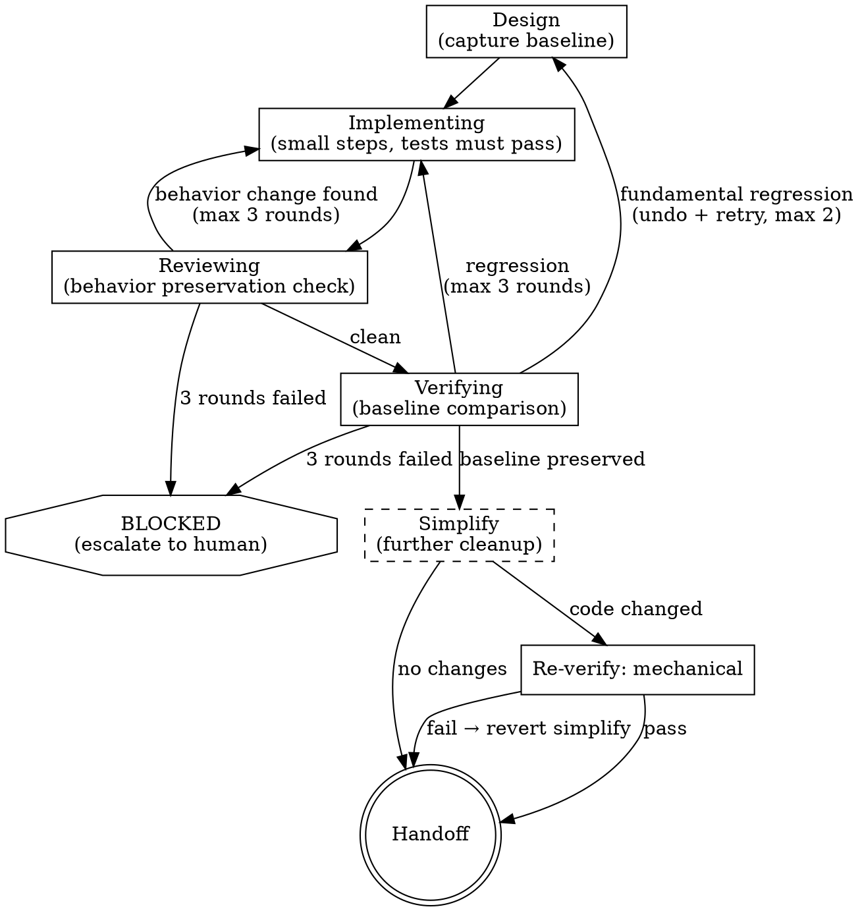

# Ship: Refactor

Behavior must not change — capture baseline first. Constraint-driven workflow
for cleanup work where code gets simpler but behavior stays stable.

Refactors do not use browser verification. If the task would change visual
behavior, it is not a refactor — use `auto` instead.

---

## Superpowers Skill Interop

| Phase | Superpowers Skill | When to invoke |
|-------|-------------------|----------------|
| design (baseline capture) | `writing-plans` | Capture current behavior as baseline |
| implementing (small steps) | `executing-plans` | Incremental refactoring |
| reviewing | `requesting-code-review` | Verify behavior preservation |
| simplify (post-verify) | `simplify` | Further cleanup after verification passes |
| verifying | `verification-before-completion` | Confirm no regressions |

If superpowers is not installed, the guidance below is self-contained.

---

## Decision Principles

When making decisions at any phase transition, use these principles in order:

1. **Complete over partial** — Ship the whole thing. Cover all edge cases,
   not just the happy path. The marginal cost of completeness is near-zero.
2. **Fix in blast radius** — If something is broken in files touched by this
   task, fix it now. Don't defer to a follow-up.
3. **Explicit over clever** — 10-line obvious fix > 200-line abstraction.
   Pick what a new contributor reads in 30 seconds.
4. **DRY** — Duplicates existing functionality? Reuse. Don't reinvent.
5. **Bias toward action** — Advance > deliberate > stall. Log concerns
   but keep moving. Only stop if truly blocked (retries exhausted,
   missing information that cannot be inferred from code).
6. **Escalate honestly** — When retries are exhausted or confidence is low,
   stop and tell the user. Bad work is worse than no work.

## Decision Classification

Every decision falls into one of two categories:

**Mechanical** — one clearly right answer given the principles above.
Auto-decide silently. Examples:
- Tests failed → retry with error context (principle 5)
- Review found behavior change → delegate fix (principle 5)
- 3 retries exhausted → escalate to BLOCKED (principle 6)

**Judgment** — requires weighing trade-offs. Auto-decide using principles,
but log the decision and rationale to the audit trail. Examples:
- Refactored code has two structurally valid arrangements → which one?
- Review found minor style issue → fix in this pass or leave?
- Simplify pass changed significant code → keep or revert?

Both categories are auto-decided. The difference is logging:
mechanical decisions are silent, judgment decisions are logged.

## Decision Audit Trail

For every judgment decision, append a row to
`.ship/tasks/<task_id>/decisions.md`:

```markdown
| # | Phase | Decision | Principle | Rationale |
|---|-------|----------|-----------|-----------|
| 1 | implementing | Extract helper instead of inline duplication | 4 (DRY) | Same 15-line pattern in 3 call sites |
| 2 | reviewing | Keep longer but explicit function over compact version | 3 (explicit) | New contributor readability wins over brevity |
```

Rules:
- Create the file with header row when the first judgment decision occurs
- Append incrementally via Edit — do not rewrite the whole file
- One row per decision, keep rationale to one sentence
- The stop gate does NOT check this file (it is informational, not a gate)

## Escalation Protocol

The orchestrator MUST stop and report to the user when:
- Retries exhausted at any phase (3 fix rounds or 2 re-designs)
- Refactoring introduced a behavioral regression that cannot be fixed
- Baseline tests were already failing before the refactor began
- Confidence in behavior preservation is low

When escalating, report:

```
STATUS: BLOCKED
REASON: [1-2 sentences]
ATTEMPTED: [what was tried and how many times]
RECOMMENDATION: [what the user should do next]
```

Do not attempt to work around the blocker. Do not retry beyond limits.
Bad work is worse than no work.

---

## State Management

State is derived from artifacts on disk in `.ship/tasks/<task_id>/`.
The orchestrator never writes state files — phase is determined by which
artifacts exist and their content.

Before starting or resuming any refactor task, run the ship preamble:
`Bash("bash ${CLAUDE_PLUGIN_ROOT}/bin/preamble.sh refactor")`

### Artifact-Based Phase Detection

| Artifact | Meaning |
|----------|---------|
| `spec.md` exists with content | Design: baseline captured |
| `plan/plan.md` exists with stories | Design complete, ready to implement |
| `review.md` has review content | Review performed |
| `review.md` shows clean review | Review passed |
| `verify.md` has passing results | Verification passed |
| Git log shows story work committed | Stories implemented |

---

## Phase Guidance



### Design (Baseline Capture)

Capture existing behavior as the baseline for verification.

- Record current test results as the behavioral baseline
- Identify exactly what will be refactored and what should not change
- Write spec to `.ship/tasks/<task_id>/spec.md` (filled with content)
- Write plan to `.ship/tasks/<task_id>/plan/plan.md` (filled with content)
- Create task directory with `mkdir -p .ship/tasks/<task_id>/plan`
- Create empty artifact stubs for phases not yet reached:
  - `review.md` — empty stub (reviewing phase fills)
  - `verify.md` — empty stub (verifying phase fills)
  - Do NOT create `verify-frontend.md` — refactors skip browser verification
- Proceed once the plan is recorded unless the task truly requires a user
  decision, explicit design approval, or missing information that cannot be
  derived from repo truth or task state

**Before advancing to implementing:**
- [ ] `spec.md` is filled (baseline captured)
- [ ] `plan/plan.md` exists with stories
- [ ] Empty stubs for `review.md` and `verify.md` exist

### Implementing (Small Steps)

Refactor in small, independently verifiable increments.

- Delegate to a fast execution model (codex by default):
  `Bash("codex exec '<refactor step + baseline context>' --full-auto")`
- Each step must pass existing tests before moving to the next
- No new behavior — only structural changes
- Each commit must pass pre-commit lint

**Before advancing to reviewing:**
- [ ] Active story's work is committed
- [ ] Existing tests still pass

### Reviewing

Review focuses on behavior preservation, not just code quality.

- Delegate to a high-reasoning model (claude by default):
  `Bash("claude -p '<review prompt>'")`
- **Review MUST use an opus-level model**
- Key question: does the diff change any observable behavior?
- Record in `.ship/tasks/<task_id>/review.md`
- If review finds issues, delegate fix based on `review.md`

**Before advancing to verifying:**
- [ ] `review.md` shows clean review

### Verifying

Confirm refactored code behaves identically to baseline.

- **Mechanical:** run baseline test suite, compare results
  - Record results in `verify.md` (append section with command output,
    pass/fail, HEAD sha)
- **Spec:** verify baseline behavior is preserved
  - Record results in `verify.md`
- No browser verification for refactors

**Before advancing to handoff:**
- [ ] `verify.md` is filled with passing results
- [ ] All stories implemented (check git log)
- [ ] `review.md` clean, `verify.md` passing

### Handoff

- Self-check quality gate (see below)
- Ensure all changes are on a feature branch
  (if on main/master: `Bash("git checkout -b ship/<task_id>")`)
- Push and create PR:
  `Bash("git push -u origin HEAD && gh pr create --title '<task title>' --body \"$(cat .ship/tasks/<task_id>/spec.md)\n\n---\n🤖 Generated with [SHIP](https://www.ship.tech/)\"")`

---

## Delegation Routing Defaults

Same as auto. Review and spec verification must use opus-level model.

---

## Recovery Loops

| Trigger | Path | Max retries |
|---------|------|-------------|
| Mechanical regression | verify → fix → verify | 3 |
| Review finds behavior change | review → fix → review | 3 |
| Spec baseline gap | spec → fix → mechanical → spec | 3 |
| Fundamental regression | spec → undo + retry (back to implementing) | 2 |
| Simplify changes code | simplify → re-verify mechanical → handoff (fail → revert simplify) | — |

After retries exhausted → escalate to user. Do not attempt further.

---

## Quality Gate Self-Check

Before completing, check artifacts on disk and verify ALL of the following:

**Artifacts filled (no empty .md files):**
- [ ] `spec.md` — has content (baseline + refactor scope)
- [ ] `plan/plan.md` — has content
- [ ] `review.md` — has clean review content
- [ ] `verify.md` — has passing verification results

**State is clean (derived from artifacts):**
- [ ] All stories implemented (check git log)
- [ ] `review.md` clean, `verify.md` passing
- [ ] No unresolved findings in `review.md`

If any check fails, go back to the phase that owns it.
