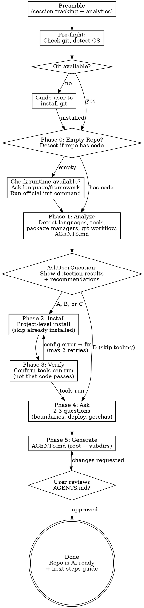

# Ship: Init

One command. Bare repo in, AI-ready repo out.

Analyze the repo, install missing tools, improve weak configs, generate
AGENTS.md, and leave the repo ready for `/ship-coding`.

This skill is idempotent — running it twice on the same repo skips
already-installed tools and only applies new improvements.

---

## Preamble

Before starting, run the ship preamble for session tracking and analytics:

`Bash("bash ${CLAUDE_PLUGIN_ROOT}/bin/preamble.sh setup")`

---

## Process Flow



---

## Pre-flight: Environment Check

Before anything else, verify the minimal environment exists.

### Git

```bash
which git 2>/dev/null && echo "GIT_OK" || echo "GIT_MISSING"
```

If `GIT_MISSING`:

```
Re-ground: Setting up your repo for AI-assisted development.

Simplify: Git is the tool that tracks all changes to your code — like
a save system for your entire project. Every AI coding tool needs it.
Without git, nothing else works.

RECOMMENDATION: Choose A — git is required for everything that follows.

A) I'll install it now (guide me)
B) I already have it somewhere else (let me fix my PATH)
```

If A, read `references/runtime-install-guide.md` for platform-specific
git installation guidance. On macOS: `xcode-select --install` (includes git).

After git is confirmed, check if the current directory is a git repo:
```bash
git rev-parse --is-inside-work-tree 2>/dev/null && echo "REPO_OK" || echo "NOT_A_REPO"
```

If `NOT_A_REPO`, run `git init` and create an initial commit.

---

## Phase 0: Empty Repo Detection

Check if the repo has any source code files:

```bash
# Check for common source files (exclude config, docs, dotfiles)
CODE_FILES=$(find . -maxdepth 3 -type f \( -name "*.go" -o -name "*.py" -o -name "*.ts" -o -name "*.js" -o -name "*.rs" -o -name "*.java" -o -name "*.kt" -o -name "*.rb" -o -name "*.swift" \) -not -path "*/node_modules/*" -not -path "*/.git/*" 2>/dev/null | head -1)
```

If no source code files found, the repo is empty or has only config/docs.
Ask the user what they want to build:

```
Re-ground: Your repo doesn't have any source code yet. Before setting
up AI tooling, we need to initialize a project.

Simplify: Think of this like moving into a new house — we need to lay
the foundation before we can install the appliances. I'll run the
official setup command for your chosen language.

RECOMMENDATION: Choose the option that matches what you want to build.

A) Python project → uv init (or pip init)
B) TypeScript/Node project → npm init -y
C) Go project → go mod init <module-name>
D) React/Next.js app → npx create-next-app@latest
E) Expo/React Native app → npx create-expo-app@latest
F) Rust project → cargo init
G) Other (please describe)
H) I'll initialize myself, just set up tooling for what's already here
```

After the user chooses, **check if the required runtime is installed** before
running the init command:

| Choice | Check |
|--------|-------|
| Python | `which python3` or `which python` |
| Node/TS/React/Expo | `which node` and `which npm` |
| Go | `which go` |
| Rust | `which cargo` |

If the runtime is missing, read `references/runtime-install-guide.md` for
platform-specific install instructions. Guide the user through the install
and wait for them to confirm before proceeding.

Once the runtime is confirmed, run the corresponding official init command.
If the command requires input (like a module name), ask for it.
Then proceed to Phase 1.

If the repo already has code, skip directly to Phase 1.

---

## Phase 1: Analyze

Use Read, Grep, and Glob to explore the repo. For each category below,
classify as one of three states:

- **Missing** (✗) — not present, recommend installing
- **Improvable** (△) — present but weak/outdated/incomplete, recommend improving
- **Ready** (✓) — good as-is, don't touch

### 1.1 Language & Package Manager Detection

Scan for language markers and verify package managers are available:

| Language | Markers | Package Manager | Check available |
|----------|---------|-----------------|-----------------|
| Go | `go.mod`, `*.go` files | go | `which go` |
| Python | `pyproject.toml`, `setup.py`, `requirements.txt`, `*.py` files | pip/uv | `which pip` or `which uv` |
| TypeScript/JavaScript | `package.json`, `tsconfig.json`, `*.ts`/`*.js` files | npm/yarn/pnpm | `which npm` or `which yarn` or `which pnpm` |
| Rust | `Cargo.toml` | cargo | `which cargo` |
| Java/Kotlin | `pom.xml`, `build.gradle`, `*.java`/`*.kt` files | maven/gradle | `which mvn` or `which gradle` |

If a language is detected but its package manager is not available, flag it:
`✗ Python detected but pip/uv not found — cannot install tools. Install Python first.`

**Monorepo detection:** If multiple `package.json`, `go.mod`, or `pyproject.toml`
files exist at different directory levels, note the locations. Phase 2 will install
tools in the correct directory for each module (e.g., `cd frontend && npm install -D eslint`).

### 1.2 Tooling Detection

For each detected language, check:

**Linter:**

| Language | Check for | If missing |
|----------|-----------|------------|
| Python | `ruff.toml`, `ruff` section in `pyproject.toml`, `.flake8` | Install ruff |
| TypeScript | `.eslintrc.*`, `eslint.config.*` | Install eslint |
| Go | `.golangci.yml` | Install golangci-lint |

If present, evaluate quality:
- Are strict rules enabled?
- Is the config up-to-date with current tool version?
- Are important rules missing? (e.g., `no-unused-vars`, `strict` preset)

**Formatter:**

| Language | Check for | If missing |
|----------|-----------|------------|
| Python | ruff format config, `.style.yapf`, `black` config | Configure ruff format |
| TypeScript | `.prettierrc`, prettier in package.json | Install prettier |
| Go | gofmt (always available) | — |

**Type checker:**

| Language | Check for | If missing |
|----------|-----------|------------|
| Python | `pyrightconfig.json`, pyright in `pyproject.toml` | Install pyright |
| TypeScript | `tsconfig.json` with `strict: true` | Enable strict mode |

**Test runner:**

| Language | Check for | If missing |
|----------|-----------|------------|
| Python | pytest config, `tests/` dir | Install pytest + pytest-cov |
| TypeScript | jest/vitest config, `*.test.*` files | Install vitest or jest |
| Go | `*_test.go` files | Built-in |

If present, evaluate:
- Is coverage configured?
- Is there a minimum coverage threshold?

**Pre-commit hooks:**

Check for `.pre-commit-config.yaml`, `.husky/`, `.git/hooks/pre-commit`.
If present, evaluate: does it run lint + format + typecheck?

### 1.3 Git Workflow Detection

Check the git environment and workflow setup:

**`.gitignore`:**
- Does it exist?
- Does it cover the detected languages? (e.g., `node_modules/` for JS,
  `__pycache__/` for Python, `/bin/` for Go)
- Is it comprehensive or just a stub?

If missing or incomplete → classify as Missing/Improvable.

**`.github/pull_request_template.md`:**
- Does it exist?
- If missing → classify as Missing (ship-coding creates PRs and benefits
  from a template)

**Git initialization:**
- Is `.git/` present? If not, the repo isn't a git repo yet
- Does the repo have a remote? (`git remote -v`)
- Is there at least one commit?

### 1.4 CI/CD Detection

Check for existing GitHub Actions and automation:

**CI workflow (`.github/workflows/ci.yml` or similar):**
- Does any workflow run lint + test + typecheck on PR?
- If present, evaluate: does it cover all detected languages?
- If missing → classify as Missing

**Dependabot (`.github/dependabot.yml`):**
- Does it exist?
- Does it cover the detected package ecosystems?
- Does it also cover `github-actions` ecosystem?
- If missing → classify as Missing

**Auto-labeler (`.github/labeler.yml`):**
- Does it exist?
- If missing → classify as Missing

**AI code review:**
- Is there an existing AI review workflow? (CodeRabbit, Codex review, etc.)
- Check for `.github/workflows/*review*` or CodeRabbit config
- If missing → will ask user in Phase 4

### 1.5 AGENTS.md Detection

Check for existing instruction files:

- `AGENTS.md` or `CLAUDE.md` at repo root
- `AGENTS.md` or `CLAUDE.md` in subdirectories
- `.github/copilot-instructions.md`
- `.cursorrules` or `.cursor/rules/`

If AGENTS.md exists, evaluate quality:
- Has exact build/test/lint commands? (highest value)
- Has boundaries (never do)?
- Is under 200 lines? (over 200 degrades adherence)
- Has unnecessary content? (code descriptions AI can read itself)
- Has stale/outdated information?

### 1.5 Present Results

Format the analysis as a structured AskUserQuestion:

```
Re-ground: Setting up AI development harness for your repo on branch <branch>.

Simplify: I scanned your codebase to figure out what tools are installed
and what's missing. Here's the full picture — green means ready, yellow
means could be better, red means not installed.

Languages: Go, Python, TypeScript
Package managers: go ✓, pip ✓, npm ✓

TOOLING:
✗ Missing (need to install):
  - Python linter (ruff)
  - Pre-commit hooks

△ Improvable (suggest optimizing):
  - eslint: enable strict rules + no-unused-vars
  - pytest: add coverage config (80% minimum)
  - husky: add lint + typecheck to pre-commit

✓ Ready:
  - gofmt, prettier, tsc (strict mode)

GIT WORKFLOW:
✗ Missing:
  - .gitignore (no gitignore for Python/Node artifacts)
  - PR template (.github/pull_request_template.md)

CI/CD:
✗ Missing:
  - CI workflow (lint + test + typecheck on PR)
  - Dependabot (automated dependency updates)
  - Auto-labeler (label PRs by changed files)
  - AI code review (will ask in Phase 4)

AGENTS.md:
✗ No AGENTS.md found — will generate after tooling setup

RECOMMENDATION: Choose A — installs everything missing and applies all
improvements. This gives AI agents the best environment to work in.

A) Accept all (recommended)
B) Install missing only, let me pick improvements
C) Install missing only, skip improvements
D) Skip tooling entirely, just generate AGENTS.md
```

---

## Phase 2: Install

Based on user's choice, install tools and generate/update config files.

**Idempotency rule:** Skip installation for tools that Phase 1 classified
as Ready (✓). Only install Missing (✗) tools and apply Improvable (△)
changes based on user's selection.

For each tool:
1. `cd` to the correct directory (repo root, or module directory for monorepos)
2. Install the package **at project level** (never global):
   - Python: `pip install --user <pkg>` or `uv add --dev <pkg>`
   - TypeScript: `npm install -D <pkg>` (or yarn/pnpm equivalent)
   - Go: `go install <pkg>@latest` (goes to GOPATH, not global)
   - If permission denied: do NOT use sudo. Tell the user how to fix
     their permissions or use a version manager (nvm, pyenv, etc.)
3. Generate or update the config file
4. Ensure `.gitignore` covers install artifacts (`node_modules/`, `__pycache__/`,
   `.ruff_cache/`, etc.) — add entries if missing
5. Commit the change atomically: `feat(tooling): add <tool> with <config>`

**Monorepo handling:** If Phase 1 detected multiple modules, install tools
in each module's directory using its own package manager. For example:
- `cd frontend && npm install -D eslint prettier`
- `cd backend && pip install ruff pyright`

**Git workflow setup (if Missing/Improvable in Phase 1.3):**

1. **`.gitignore`** — Generate based on detected languages using standard templates.
   Merge with existing if already present (don't remove user's custom entries).
   Common entries by language:
   - Python: `__pycache__/`, `*.pyc`, `.ruff_cache/`, `.venv/`, `dist/`
   - TypeScript: `node_modules/`, `dist/`, `.next/`, `coverage/`
   - Go: `/bin/`, `/vendor/`
   - General: `.env`, `.DS_Store`, `*.log`

2. **`.github/pull_request_template.md`** — Simple template:
   ```markdown
   ## Summary
   <!-- What does this PR do? -->

   ## Test plan
   <!-- How was this tested? -->
   ```

3. **Git init** — If `.git/` doesn't exist, run `git init` and create initial commit.

Commit: `chore: set up git workflow (.gitignore, PR template)`

**CI/CD setup (if Missing in Phase 1.4):**

4. **`.github/workflows/ci.yml`** — Read the language-specific template from
   `templates/` and adapt to this repo's actual commands:
   - Node/TS: read `templates/ci-node.yml`
   - Python: read `templates/ci-python.yml`
   - Go: read `templates/ci-go.yml`
   - Multi-language: combine relevant jobs into one workflow
   - Replace placeholder commands with the exact commands from Phase 3 verification.

5. **`.github/dependabot.yml`** — Read `templates/dependabot.yml` and adapt:
   replace the package-ecosystem with the detected ecosystems (npm, pip, gomod, cargo).
   Always keep the github-actions entry.

6. **`.github/workflows/auto-merge-dependabot.yml`** — Copy from
   `templates/auto-merge-dependabot.yml` as-is. No adaptation needed.

7. **`.github/labeler.yml`** + **`.github/workflows/labeler.yml`** — Read
   `templates/labeler.yml` and `templates/labeler-workflow.yml`. Adapt label
   rules to match the actual repo directory structure detected in Phase 1.

Commit: `chore: set up CI/CD (GitHub Actions, Dependabot, auto-labeler)`

**Config generation guidelines:**
- Use the tool's recommended/strict preset as baseline
- Adapt to the repo's existing style (e.g., tabs vs spaces, quote style)
- Don't override existing config choices without the improvement being clear

---

## Phase 2.5: Policy Generation

Generate `.ship/ship.policy.json` if it does not already exist.

**Idempotency:** If `.ship/ship.policy.json` already exists, skip this phase entirely.

1. Read the default template from `${CLAUDE_PLUGIN_ROOT}/skills/setup/templates/ship.policy.json`
2. Copy it to `.ship/ship.policy.json`
3. Fill in `quality.pre_commit` based on languages detected in Phase 1:

| Language | pre_commit entries |
|----------|-------------------|
| TypeScript | `{"command": "npm test", "name": "tests"}`, `{"command": "npm run lint", "name": "linter"}` |
| Python | `{"command": "pytest", "name": "tests"}`, `{"command": "ruff check .", "name": "linter"}` |
| Go | `{"command": "go test ./...", "name": "tests"}`, `{"command": "go vet ./...", "name": "vet"}` |
| Rust | `{"command": "cargo test", "name": "tests"}`, `{"command": "cargo clippy", "name": "clippy"}` |

Use `jq` to update the `quality.pre_commit` array in the generated file.
Only add entries for languages actually detected — don't add Python commands to a TypeScript-only repo.

4. Fill in `quality.require_tests.source_patterns` and `test_patterns`:

| Language | source_patterns | test_patterns |
|----------|----------------|---------------|
| TypeScript | `["src/**/*.ts", "!src/**/*.d.ts"]` | `["**/*.test.ts", "**/*.spec.ts"]` |
| Python | `["src/**/*.py", "!src/**/__init__.py"]` | `["tests/**/*.py", "**/test_*.py"]` |
| Go | `["**/*.go", "!**/*_test.go"]` | `["**/*_test.go"]` |

5. Update `.gitignore` to track policy but ignore ephemeral files:
   - Remove `.ship/` if present (broad ignore)
   - Add `.ship/tasks/` and `.ship/audit/` (narrow ignores)

6. Commit: `feat(policy): generate default policy for AI guardrails`

---

## Phase 3: Verify

Confirm each installed tool **can run** — not that all code passes lint.
A repo that has never been linted will have code-level errors; that's
expected and will be fixed during `/ship-coding`, not during init.

**Success criteria:** The tool executes and produces output (exit code 0
or lint warnings/errors). Failure is when the tool **crashes**, reports
a config error, or cannot find its configuration.

```bash
# Verify tools can run (code-level errors are expected and OK):
ruff check . || true        # exits non-zero on lint errors — that's fine
ruff format --check . || true
npx eslint . || true
npx prettier --check . || true
go vet ./...
pytest --co -q              # collect only — verify pytest finds tests
npx tsc --noEmit || true    # type errors in code are OK
```

If a tool **crashes or reports a config error** (not code errors):
- Read the error output
- Fix the config (not the code — init doesn't modify source code)
- Retry (max 2 attempts)
- If still failing, note it in AGENTS.md as a known issue

---

## Phase 4: Ask

Ask 2-3 questions to fill in information that cannot be derived from code.
Use gstack-style AskUserQuestion format: re-ground, simplify, recommend, options.

### Question 1: Security Boundaries

```
Re-ground: We've installed the development tools for your repo. Now
setting up safety rules that tell AI agents what they must never do.

Simplify: Think of these as guardrails — like "never delete the
production database" for AI. They prevent AI agents from accidentally
breaking things that are hard to undo.

RECOMMENDATION: Choose A — covers the most common safety rules that
prevent real-world incidents.

A) Standard boundaries (recommended):
   - Never commit secrets or credentials
   - Never delete or skip failing tests
   - Never modify CI/CD pipelines without confirmation
   - Never modify auth/permission code without confirmation
B) Standard + custom (I want to add more)
C) Skip — no special boundaries
```

### Question 2: Deploy & Infra

```
Re-ground: Continuing AI harness setup for your repo.

Simplify: Knowing how your app gets deployed helps AI agents understand
which changes are risky. For example, if you deploy to Kubernetes, the
agent knows to be careful with Docker configs and health checks.

RECOMMENDATION: Choose the option that matches your setup. If unsure,
choose A — it's the safest default.

A) Not deployed / local project / library
B) Cloud platform (Vercel / Netlify / Fly.io / Render)
C) Container-based (K8s / Docker / ECS)
D) Other (please describe)
```

### Question 3: Gotchas

```
Re-ground: Final question for your AI harness setup.

Simplify: Every codebase has quirks that take a new team member a week
to discover — things like "you have to run service X before service Y"
or "don't touch the legacy/ folder." These save the AI agent from
making the same mistakes.

RECOMMENDATION: Choose B if you can think of anything — even one gotcha
is valuable. Choose A if the repo is genuinely straightforward.

A) No gotchas — repo is straightforward
B) Yes, here are some: (please describe)
```

### Question 4: AI Code Review (only ask if no AI review detected in Phase 1.4)

```
Re-ground: Final setup question — automated code review for your PRs.

Simplify: You're already using an AI coding agent (Claude or Codex) to
write code. You can also have AI automatically review every pull request
before you merge it — like a second developer checking your work 24/7.
Since you already have an API key, this uses the same account you're
paying for.

RECOMMENDATION: Choose C for maximum coverage — two different AI models
reviewing the same code catch different issues.

A) Claude review (uses your Anthropic API key)
   → Generates .github/workflows/ai-review.yml with claude -p
B) Codex review (uses your OpenAI API key)
   → Generates .github/workflows/ai-review.yml with codex review
C) Both — Claude + Codex cross-review (most thorough)
   → Two separate review jobs in the workflow
D) CodeRabbit (free for public repos, no API key needed)
   → Guides you to install the CodeRabbit GitHub App
E) Skip — I'll review PRs myself
```

If A, B, or C: generate `.github/workflows/ai-review.yml` with the
corresponding review command. The workflow should:
- Trigger on `pull_request` events
- Check out the code
- Run the review command on the diff
- Post results as a PR comment

If D: tell the user to install CodeRabbit at https://coderabbit.ai
and skip the workflow generation.

Commit: `chore: set up AI code review on PRs`

---

## Phase 5: Generate

Generate AGENTS.md files. Target: under 200 lines per file.

### Root AGENTS.md Template

Read `templates/agents-md.md` as the base template. Fill in:
- Commands: use the exact commands from Phase 2 install + Phase 3 verify
- Repository Map: from Phase 1 language detection
- Code Style: only conventions that differ from language defaults (read actual code for examples)
- Boundaries: from Phase 4 Q1 answers
- Testing: from Phase 1.2 test runner detection
- Gotchas: from Phase 4 Q3 answers

Target: under 200 lines. Do NOT include code descriptions — AI reads code itself.

### Subdirectory AGENTS.md

Generate for subdirectories that have their own `package.json`, `go.mod`,
or `pyproject.toml` — these are independent modules with their own build
and test commands. Only include information that differs from root.
Keep very short:

```markdown
# AGENTS.md — <module name>

## Commands
[Only if different from root]

## Code Style
[Only module-specific conventions]
```

### If AGENTS.md Already Exists

Do NOT overwrite. Instead:
1. Read the existing file
2. Generate the improved version
3. Show a diff to the user
4. AskUserQuestion: accept all / accept some / keep original

### Present to User

After generating, show the content and ask for review:

```
Generated AGENTS.md (<N> lines). Here's the content:

<full content>

A) Looks good, commit it
B) I want to make changes (tell me what to adjust)
```

Commit on approval: `feat: generate AGENTS.md for AI agent harness`

---

## What Init Does NOT Do

- **Does not modify source code** — only config files and documentation
- **Does not generate code documentation** — AI reads code itself
- **Does not generate architecture docs** — requires human knowledge
- **Does not install ship skills** — that's a separate install step
- **Does not fabricate information** — only writes what it can verify from code

---

## Completion

After all phases complete, summarize:

```
Init complete. Your repo is now AI-ready:

Environment:
  ✓ Git initialized, .gitignore configured
  ✓ PR template created

CI/CD:
  ✓ CI workflow (lint + test + typecheck on every PR)
  ✓ Dependabot (weekly dependency updates, auto-merge minor/patch)
  ✓ Auto-labeler (PRs labeled by changed files)
  ✓ AI code review (Claude + Codex cross-review on PRs)

Tooling:
  ✓ Linter: ruff, eslint (strict)
  ✓ Formatter: ruff format, prettier
  ✓ Type checker: pyright, tsc (strict)
  ✓ Tests: pytest (80% coverage), vitest
  ✓ Pre-commit: lint + format + typecheck

Documentation:
  ✓ AGENTS.md (root, 87 lines)
  ✓ AGENTS.md (frontend/, 23 lines)
```

### What to do next

Tell the user:

```
Your repo is ready for AI-assisted development. Here's what you can do:

1. /ship-coding "describe what you want to build"
   → AI designs, implements, reviews, tests, and creates a PR for you.
   → Example: /ship-coding "add a login page with email and password"

2. /ship-debug "describe the bug"
   → AI investigates, finds the root cause, fixes it, and adds a regression test.
   → Example: /ship-debug "the app crashes when I click submit with empty form"

3. /ship-refactor "describe what to clean up"
   → AI restructures code without changing behavior.
   → Example: /ship-refactor "split the large utils.ts into smaller modules"

Just describe what you want in plain language. The AI handles the rest.
```
